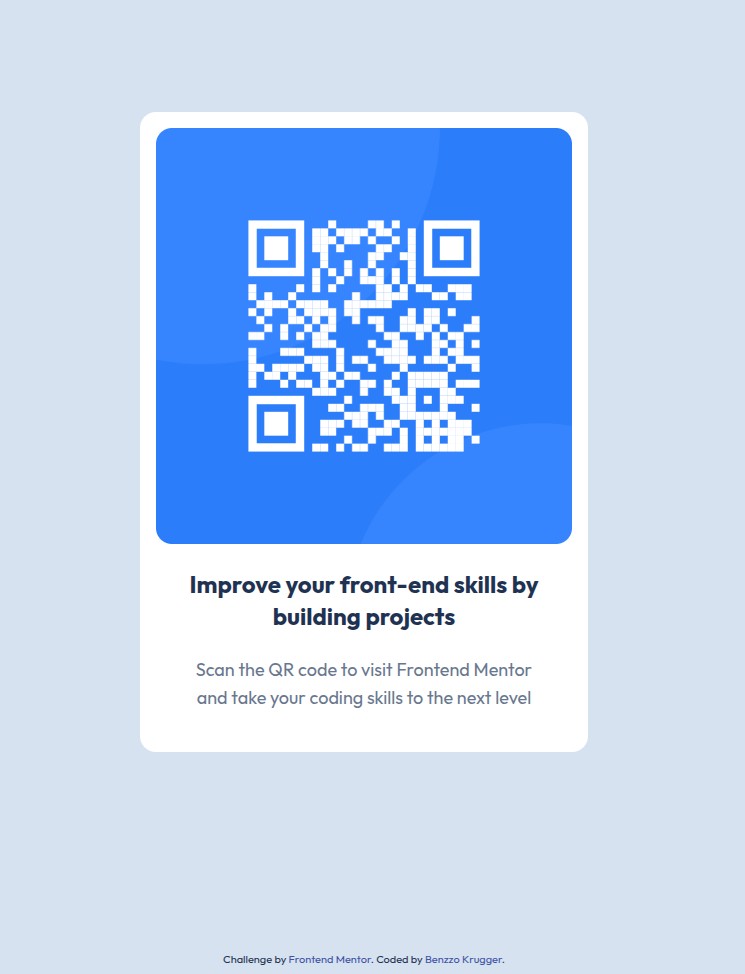

# Frontend Mentor - QR code component solution

This is a solution to the [QR code component challenge on Frontend Mentor](https://www.frontendmentor.io/challenges/qr-code-component-iux_sIO_H). Frontend Mentor challenges help you improve your coding skills by building realistic projects. 

## Table of contents

- [Overview](#overview)
  - [Screenshot](#screenshot)
  - [Links](#links)
- [My process](#my-process)
  - [Built with](#built-with)
  - [What I learned](#what-i-learned)
  - [AI Collaboration](#ai-collaboration)
- [Author](#author)


**Note: Delete this note and update the table of contents based on what sections you keep.**

## Overview

### Screenshot




### Links

- Solution URL: [Add solution URL here](https://github.com/BenzzoKrugger/fm-qr-component)
- Live Site URL: [Add live site URL here](https://benzzokrugger.github.io/fm-qr-component/)

## My process

### Built with

- Semantic HTML5 markup
- Flexbox
- Tailwind
- Mobile-first workflow


### What I learned

I learned how to import tailwindcss to html. Command to run live watch: 
```npx @tailwindcss/cli -i ./styles/input.css -o ./styles/output.css --watch```


### AI Collaboration

I used AI to ask how to center one element to center and the footer down at the very bottom of the page. My solution with many divs worked, but i knew it has to be some cleaner solution. It was, and its called ```flex-1```!  It extends element to take all available space.

## Author

- Website - [Benzzo](https://www.benzzo.cz)
- Frontend Mentor - [@BenzzoKrugger](https://www.frontendmentor.io/profile/BenzzoKrugger)

